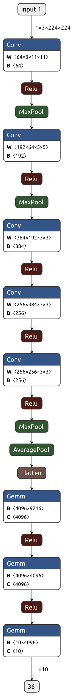

# ALEX NET
**[1]** Alex Net
Krizhevsky, Alex, Ilya Sutskever, and Geoffrey E. Hinton. "Imagenet classification with deep convolutional neural networks." Advances in neural information processing systems. 2012
[Paper](http://papers.nips.cc/paper/4824-imagenet-classification-with-deep-convolutional-neural-networks.pdf)

## Notes
- Use ReLU instead of Tanh
- Use Average Pool as overlapping pooling -> Less likely to overfit
- Use dropout
- Data Augmentation
- Other details
  - SGD : momentum = 0.9, weight decay = .0005

- Architecture

-
