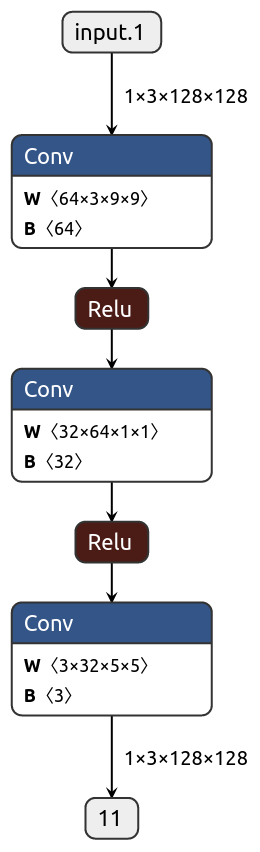

**[11]** SRCNN
- Dong, C., Loy, C. C., He, K., & Tang, X. (2014, September). Learning a deep convolutional network for image super-resolution. In European conference on computer vision (pp. 184-199). Springer, Cham.

# Notes
- Low to high res
- Path extraction+aggregation -> conv
  - Non linear mapping -> Extract n1 dimensional features, map each to n2 dimensional. (1x1)
  - Reconstruction -> predicted overlapping are averaged
  - MSE loss

# Architecture
- 
