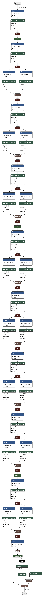

**[9]** Squeeze Net
- SqueezeNet: AlexNet-level accuracy with 50x fewer parameters and< 1MB model size (2016), F. Iandola et al.
[Paper](http://arxiv.org/pdf/1602.07360)

# Notes
- 510x smaller than AlexNet
- Replace 3x3 with 1x1
- Decrease no of input channles for 3x3
- Downsample towards the end
  - Conv layers have larger activation maps
- Fire module
  - Squeeze -> 1x1 only
  - Expand -> 1x1 and 3x3
- Can be implemented in an FPGA

SqueezeNet is one of several new CNNs that we have discovered while broadly exploring the de-
sign space of CNN architectures. We hope that SqueezeNet will inspire the reader to consider and
explore the broad range of possibilities in the design space of CNN architectures and to perform that exploration in a more systematic manner.

- Architecture
- 
