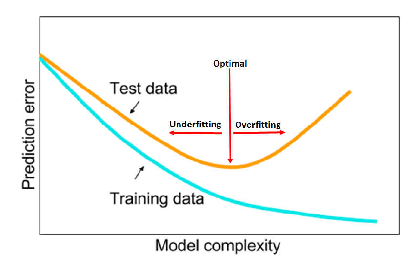

**[14]** A disciplined approach to neural network hyper-parameters
- Smith, L. N. (2018). A disciplined approach to neural network hyper-parameters: Part 1--learning rate, batch size, momentum, and weight decay. arXiv preprint arXiv:1803.09820.
[Paper](https://arxiv.org/pdf/1803.09820)

## Notes
- examine the training validation/test loss function for subtle
clues of underfitting and overfitting
- The test/validation loss is a good indicator of the network’s convergence
- Achieving the horizontal part of the test loss is the goal of hyper-
parameter tuning.

- If the hyper-parameters are set well at the beginning, they will perform well through the entire training process. In addition, if the hyper- parameters are set using only a few epochs, a significant time savings is possible in the search for hyper-parameters.
- Increasing the learning rate moves the training from underfitting towards overfitting
- Test loss decreases more rapidly during the initial iterations and is then horizontal. This is one of the early positive clues that indicates that this curve’s configuration will produce a better final accuracy than the other configuration, which it does.
- Use Cyclical learning rates (CLR) and the learning rate range test (LR range test)
- Take note that there is a maximum speed the learning rate can increase without the training becoming unstable, which effects your choices for the minimum and maximum learning rates
- always use one cycle that is smaller than the total number of iterations/epochs and allow the learning rate to decrease several orders of magnitude less than the initial learning rate for the remaining iterations. We named this learning rate policy “1cycle”
-  MNIST, Cifar10, Cifar-100, and Imagenet, and various architectures,
such as shallow nets, resnets, wide resnets, densenets, inception-resnet, show that all can be trained more quickly with large learning rates, provided other forms of regularizations are reduced to an optimal balance point.
- larger batch size when using the 1cycle learning rate schedule. Larger batch sizes used larger learning rates
- Although the larger batch sizes have lower loss values early in the training, the final loss values are lower as the batch sizes decrease, which is the opposite performance as accuracy results
- Although the increasing momentum stabilizes the convergence to a larger learning rate, the
minimum test loss is higher than the minimum test loss for the constant momentum case.
- With either cyclical learning rate or constant learning rate, a good procedure is to test momentum values in the range of 0.9 to 0.99 and choose a value that performs best
- complex dataset requires less regularization so test smaller weight decay values, such as
10−4 , 10−5, 10−6, 0. A shallow architecture requires more regularization so test larger
weight decay values, such as 10−2 , 10−3, 10−4
