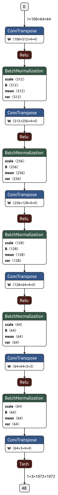
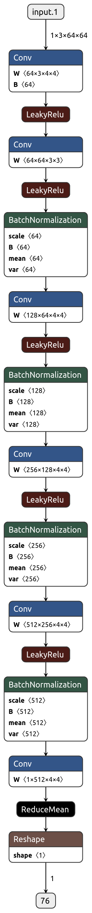

**[12]** WGAN
- Arjovsky, M., Chintala, S., & Bottou, L. (2017). Wasserstein gan. arXiv preprint arXiv:1701.07875.
[Paper](https://arxiv.org/pdf/1701.07875.pdf%20http://arxiv.org/abs/1701.07875
)
- Infinite anime faces
- [Dataset Link](https://github.com/Mckinsey666/Anime-Face-Dataset)

# Tricks
- No requirement of maintaining balance between discriminator and generator training
- mode dropping is reduced
- Use EM distance instead of KL divergence
- alpha = .00005, c = .01, m = 64, ncrit = 5

## Examples
- 
- 

## Architecture

# Discriminator
-
# Generator
-
# Network
-
