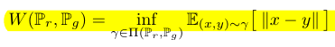

**[12]** WGAN
- Arjovsky, M., Chintala, S., & Bottou, L. (2017). Wasserstein gan. arXiv preprint arXiv:1701.07875.
[Paper](https://arxiv.org/pdf/1701.07875.pdf%20http://arxiv.org/abs/1701.07875
)
- Infinite anime faces
- [Dataset Link](https://github.com/Mckinsey666/Anime-Face-Dataset)

# Notes
- No requirement of maintaining balance between discriminator and generator training
- mode collapse is reduced
- Use EM distance instead of KL divergence
- alpha = .00005, c = .01, m = 64, ncrit = 5
- Distances:
  - KL divergence
    - is a way of measuring the matching between two distributions
    - ```math
    D​KL​​(p∣∣q)​∑​​​p(x​i​​)⋅(log p(x​i​​)−log q(x​i​​))
    ```
  - Wasserstein Distance
    - 
  - EM distance is continuous and differentiable a.e. means that
we can (and should) train the critic till optimality.
  - The argument is simple, the
more we train the critic, the more reliable gradient of the Wasserstein we get, which
is actually useful by the fact that Wasserstein is differentiable almost everywhere.
  - improved stability of the optimization process


## Examples
- 
- 

## Architecture

# Discriminator
-
# Generator
-
# Network
-
